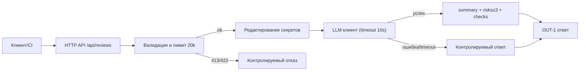

# ADR: решение для первого рабочего сценария

- Статус: proposed
- Дата: 2026-09-12
- Ответственные: команда разработки учебного кейса

## Контекст

Учебный сервис для автоматизированного выявления рисков по diff PR. Правила репозитория требуют: редактировать секреты (SEC-1), отклонять длинные diff (API-1), ограничивать время LLM-вызова и возвращать контролируемый ответ (REL-1), и выдавать результат в формате OUT-1.
## Решение

В первом рабочем сценарии внедряем:
1) Валидацию входа и ограничение длины diff с возвратом 413 (API-1).
2) Редактирование секретов до обращения к LLM (SEC-1).
3) Ограничение и обработку ошибок LLM (timeout 10s) с контролируемым ответом (REL-1).
4) OUT-1: единый формат ответа и контракт на структуру — summary, risks (≤3), checks; планируется закрепить JSON-схемой (валидация — на уровнях unit/integration); детерминированный порядок risks по file asc, затем line asc.
5) QA-1: подтверждение каждого риска — риск сохраняется только если имеет evidence (один из: выдержка строки diff с контекстом или ссылка/идентификатор правила репозитория); риски без evidence исключаются из выдачи.
6) OBS-1: логи содержат только разрешённые поля по CASE.md: request_id, duration и status; содержимое diff и ответ модели не логируются, включая ошибки. Дополнительные метрики допускаются как отдельное проектное решение (вне OBS-1): http_requests_total, llm_requests_total, api_request_duration_seconds (histogram), controlled_llm_fail_ratio.

### Контракт OUT-1 (уточнение)

- Rule (CASE.md): верхнеуровневые поля ответа — `summary`, массив `risks` (≤3 элемента) и массив `checks`. В каждом элементе `risks` обязательны поля `file`, `line`, `evidence`, `risk`.
- Project decision: для трассируемости по QA-1 расширяем схему элемента `risks` опциональным полем `rule`. Назначение — указать идентификатор правила CASE.md, если evidence основан на правиле. Допустимые значения: `SEC-1`, `API-1`, `REL-1`, `OUT-1`, `SCOPE-1`, `QA-1`, `OBS-1`.
- Project decision — единые условия для `rule`:
  - Обязательно: если evidence содержит ссылку/идентификатор правила CASE.md, даже если вместе присутствует выдержка diff.
  - Отсутствует: если evidence представлена только выдержкой diff без ссылки на правило.
  - Комбинированный evidence (и выдержка diff, и ссылка на правило): `rule` обязателен и содержит один идентификатор правила CASE.md, выбранный как непосредственно подтверждающий данный риск. Множественные значения в `rule` не допускаются.
- Project decision: дополнительные поля вне объявленной схемы (как на верхнем уровне, так и в элементах `risks`) запрещены. Запрет означает, что продюсить/принимать можно только ключи, перечисленные в схеме; иные ключи считаются ошибкой контракта.

### Контролируемый ответ при ошибке LLM (REL-1)

- HTTP статус: 200 OK.
- Тело соответствует OUT-1 без дополнительных полей:
  - summary: «Автоматическая заглушка: LLM недоступен/ошибка. Риски не оценены.»
  - risks: пустой список []
  - checks: содержит «LLM_ERROR» или «LLM_TIMEOUT» в зависимости от причины

Ожидаемый эффект: возврат 200 и сохранение OUT-1 должны позволять пайплайну CI продолжать автоматическую обработку, фиксируя факт деградации в checks и OBS-метриках; подтверждение требует интеграции с CI и проверки наличия OBS-метрик. Поведение клиента/потребителя должно различать нормальный результат и деградацию по содержимому поля `checks`; HTTP 200 сам по себе не гарантирует продолжение обработки. Дополнительные метрики — проектное решение (вне OBS-1).

### Замечание о сортировке по серьёзности

- Сортировка по severity требует формальной шкалы/классификатора серьёзности. В текущем сценарии severity не определяется, поэтому сортировка по severity не применяется. Для детерминизма используется порядок по file, затем line.
## Рассмотренные альтернативы

| Альтернатива | Почему не выбрали сейчас |
|---|---|
| Отложить редактирование секретов | Риск утечки слишком высок даже для учебного сценария |
| Принимать любые размеры diff | Нарушает API-1 и ведёт к нестабильности/ошибкам |
| Возвращать произвольный текст LLM | Не совместимо с OUT-1 и мешает автоматизации |

### SEC-1: локальная обработка секретов (подход)

- Механизм (проектное решение для первого сценария): подход A — собственные правила.
  - Обнаружение секретов: эвристики/регексы для присваиваний токенов/паролей (напр. `token=...`, `password: ...`, `API_KEY=...`) и для блоков приватных ключей (маркировки `-----BEGIN ... PRIVATE KEY-----`/`-----END ... PRIVATE KEY-----`).
  - Замена: значения в присваиваниях заменяются на `[REDACTED]` с сохранением ключа/окружения; многострочные ключи — внутренние строки блока заменяются на `[REDACTED]`, строки BEGIN/END и тип ключа сохраняются.
  - Обрабатываемые части diff: весь текст diff, включая добавленные (`+`), удалённые (`-`) и контекстные строки — секрет может присутствовать в любой части.

- Краткое сравнение альтернатив:
  - A (собственные правила): просто, прозрачно, локально; риск пропусков нестандартных паттернов; возможны ложные срабатывания.
  - B (локальный детектор + адаптер): потенциально выше покрытие, но требует выбора/интеграции детектора и адаптера, маппинга диапазонов; непрозрачность критериев; неизвестные свойства требуют проверки.
  - C (комбинация A+B): возможно расширение покрытия по сравнению с A, но это предположение и требует проверки; при этом реализация и сопровождение сложнее, риск избыточных замен выше.

- Выбор: альтернативу A для учебного проекта, так как минимальная сложность и прозрачность правил упрощают внедрение и ревью; соответствие SEC-1 будет проверяться на практике по планам tests_unit/tests_integration. Статус: proposed — алгоритм пока не реализован.

- Ограничения: отсутствие гарантий полного покрытия секретов; возможны пропуски и ложные срабатывания; влияние на полезность diff минимизируем сохранением контекста (ключи/границы блоков, неизменённый обычный текст).

- План проверки: см. разделы [tests_unit.md → «SEC-1: сценарии редактирования секретов (unit)»](../practice_01/tests_unit.md#sec-1-сценарии-редактирования-секретов-unit) и [tests_integration.md → «SEC-1: сценарии редактирования секретов (integration)»](../practice_01/tests_integration.md#sec-1-сценарии-редактирования-секретов-integration) — сценарии с синтетическими токенами/паролями, многострочным приватным ключом, секретом в удалённой/контекстной строке, сохранением обычного текста, и захватом аргумента внешнего LLM (обработанный diff).

## Последствия и главный риск

- Положительные последствия:
  - Ожидаемое соответствие правилам SEC-1, API-1, REL-1, OUT-1 после реализации по ADR и прохождения проверок.
  - Улучшение предсказуемости и автоматизируемости за счёт стабильного формата ответа.
  - Снижение рисков безопасности (маскирование секретов).
- Ограничения:
  - Ожидаемое увеличение латентности из-за редактирования и валидации; подтверждение — нагрузочные замеры по плану tests_load.md. Для проверки гипотезы требуется сравнение до/после включения обработки секретов и валидации при одинаковых входах, нагрузке, окружении и заглушке LLM (предложенное дополнение к будущей проверке; сам tests_load.md остаётся без изменений).
  - Ограничение размера diff до 20 000 символов (часть запросов будет отклоняться).
  - Зависимость от внешнего LLM и его SLA.
- Главный риск:
  - Неполная или неверная маскировка секретов (нарушение SEC-1) при сложных паттернах.
- Как проверим риск:
  - Интеграционный тест с набором фиктивных секретов (token, password, key) и проверкой, что в отправляемом prompt все совпадения заменены на [REDACTED].

## Архитектурная схема



### API-1: уточнение лимита diff

- Что проверяется: длина исходного текстового значения поля `diff` из входного HTTP-запроса.
- Когда проверяется относительно SEC-1: проверка лимита выполняется на этапе Validator до редактирования секретов; при прохождении лимита (≤ 20 000 символов) управление передаётся в Redactor; при нарушении (> 20 000) — возвращается 413, дальнейшие шаги не выполняются.
- Порог и граница: ровно 20 000 символов допустимо (см. tests_e2e: «diff длиной ровно 20000 ... 200 OK»); больше 20 000 — отклоняется с HTTP 413 (см. CASE.md API-1).
- Что означает превышение порога: возврат HTTP 413; обработчик секретов (SEC-1) и внешний LLM не вызываются; формат тела ошибки 413 источниками не определён.
- Открытые детали, требующие решения: что считать «Unicode-символом» (кодовая точка vs графемный кластер) — не определено источниками; байты и токены LLM — другие единицы и не подменяют лимит в символах. При необходимости метод подсчёта должен быть выбран и зафиксирован отдельно, без изменения правил API-1/SEC-1. Дополнительные ограничения по строкам не вводятся, так как источники их не задают.

## Как использовали AI

- Для чего: подготовка ADR и описания первого рабочего сценария.
- Тип промпта: master prompt (см. P1-02) и отдельная запись для подготовки (P1-03).
- Строка в [`prompts.md`](prompts.md): P1-03 — подготовка документации (эта правка).
- Что проверили и исправили сами: без выполнения тестов; структурное согласование ADR с CASE.md.

## Примеры OUT-1 и контролируемого ответа

Ниже — каноничные примеры формата OUT-1 и контролируемого ответа, соответствующие правилам CASE.md и решениям ADR. Они предназначены для проверки состава полей и порядка элементов risks, а также для воспроизводимых шагов проверок. Контракт OUT-1 не изменяется этими примерами.

Основания для примеров (разделение источников требований):

- CASE.md — OUT-1: верхний уровень ответа содержит `summary`, массив `risks` (максимум 3 элемента) и массив `checks`; в каждом элементе `risks` обязательны поля `file`, `line`, `evidence`, `risk`.
- CASE.md — REL-1: внешний LLM-вызов имеет timeout 10 секунд; ошибка превращается в контролируемый ответ.
- ADR (решения проекта):
  - детерминированная сортировка `risks` по `file` asc, затем `line` asc;
  - условия для поля `rule` (обязательность при evidence-на-правило, отсутствие при чистой выдержке diff; при комбинированном evidence `rule` обязателен);
  - запрет дополнительных полей вне схемы OUT-1;
  - контролируемый ответ при ошибке LLM: HTTP 200 OK; маркеры причины в `checks` — `LLM_ERROR` или `LLM_TIMEOUT`.

### Пример 1: два подтверждённых риска из TRAINING_PR.diff (API-1, SEC-1)

- Входная ситуация:
  - В новой версии `app/api.py` маршрут `POST /api/reviews` передаёт `payload["diff"]` в сервис без проверки длины (см. `app/api.py:10` по TRAINING_PR.diff).
  - В новой версии `app/review_service.py` исходный `diff` включается в `prompt` без редактирования секретов (см. `app/review_service.py:14`).

- JSON:

```json
{
  "summary": "В учебном diff отсутствует проверка длины diff в HTTP-обработчике и исходный diff включается в prompt без редактирования секретов.",
  "risks": [
    {
      "file": "app/api.py",
      "line": 10,
      "evidence": "return review_service.review(payload[\"diff\"]); нет проверки длины diff до вызова сервиса (API-1).",
      "risk": "В HTTP-обработчике отсутствует ограничение длины diff, требуемое правилом API-1.",
      "rule": "API-1"
    },
    {
      "file": "app/review_service.py",
      "line": 14,
      "evidence": "prompt = f\"Review this pull request and find problems:\\n{diff}\"; исходный diff включён в prompt без редактирования секретов (SEC-1).",
      "risk": "Diff пересылается во внешний LLM без редактирования секретов, что нарушает SEC-1.",
      "rule": "SEC-1"
    }
  ],
  "checks": [
    "Отправить POST /api/reviews с diff длиной 20001 символов. Ожидать отклонение по API-1 (413) в реализованной версии.",
    "Передать diff с тестовыми маркерами секретов (token=abc123, password=xyz). Проверить, что в отправляемом prompt значения заменены на [REDACTED] до вызова LLM."
  ]
}
```

- Почему валиден:
  - Оба наблюдения подтверждены фрагментами из `TRAINING_PR.diff` с корректными номерами строк по новой версии файлов: `app/api.py:10`, `app/review_service.py:14`.
  - Оба риска привязаны к правилам из CASE.md: `API-1` (лимит длины diff) и `SEC-1` (редактирование секретов). В каждом элементе указан `rule`, так как evidence ссылается на правило.
  - Соблюдён контракт OUT-1: верхний уровень — `summary`, `risks` (ровно 2, ≤3) и `checks`; дополнительные поля отсутствуют; сортировка `risks` по `file` asc, затем `line` asc.
  - Checks содержат воспроизводимые действия и ожидаемый результат, не утверждая текущие измеренные статусы/утечки.

- На какие правила/решения ADR опирается:
  - CASE.md: `OUT-1` — структура ответа и ограничение ≤3 рисков; обязательные поля `file`, `line`, `evidence`, `risk`.
  - CASE.md: `QA-1` — каждый риск подтверждён evidence.
  - CASE.md: `API-1` — требование отклонять длинные diff.
  - CASE.md: `SEC-1` — требование редактировать секреты перед LLM.
  - ADR: сортировка `risks` по `file`, затем `line`; условия для `rule`; запрет дополнительных полей.

### Пример 2: контролируемый ответ при ошибке LLM (не таймаут)

- Входная ситуация:
  - При проверке будущей реализации заглушка LLM вызывает исключение (ошибка, отличная от таймаута).

- JSON:

```json
{
  "summary": "Автоматическая заглушка: LLM недоступен/ошибка. Риски не оценены.",
  "risks": [],
  "checks": ["LLM_ERROR"]
}
```

- Почему валиден:
  - Соблюдён контролируемый ответ: по CASE.md (`REL-1`) ошибка превращается в контролируемый ответ; в ADR дополнительно установлено, что HTTP статус — 200 OK (это свойство HTTP-ответа, не поле JSON), и маркеры причины в `checks` — `LLM_ERROR`/`LLM_TIMEOUT`. Тело соответствует OUT-1; риски пусты; в `checks` указан `LLM_ERROR`.
  - Дополнительные поля в JSON отсутствуют.

- На какие правила/решения ADR опирается:
  - CASE.md: `REL-1` — контролируемый ответ при ошибке LLM (описание принципа).
  - ADR: HTTP 200 OK для контролируемого ответа; маркеры `LLM_ERROR`/`LLM_TIMEOUT` в `checks`.
  - CASE.md: `OUT-1` — форма тела ответа (summary/risks/checks).

### Пример 3 (намеренно невалидный): одно нарушение контракта

- Входная ситуация:
  - Та же ситуация, что в Примере 2: ошибка LLM (исключение, не таймаут).

- JSON (с нарушением):

```json
{
  "summary": "Автоматическая заглушка: LLM недоступен/ошибка. Риски не оценены.",
  "risks": [],
  "checks": ["LLM_ERROR"],
  "status": 200
}
```

- Почему невалиден:
  - Ровно одно нарушение согласованного контракта ADR: добавлено запрещённое дополнительное верхнеуровневое поле `status`. По ADR (project decision к OUT-1) дополнительные поля запрещены; HTTP статус описывается отдельно и не включается в тело JSON. CASE.md сам по себе не устанавливает запрет на `status` и не требует HTTP 200 — это решения ADR.

- На какие правила/решения ADR опирается:
  - ADR: запрет дополнительных полей и фиксированный состав ключей в ответе; HTTP 200 OK описан как свойство контролируемого ответа, но не включается в JSON.

### Ссылки на источники

- [`TRAINING_PR.diff`](TRAINING_PR.diff)
- [`CASE.md`](CASE.md)

### Что и как проверять с этими примерами

- Валидность JSON: синтаксический парсинг и проверка состава полей (только `summary`, `risks`, `checks`), отсутствие дополнительных полей.
- Сверка номеров строк по `TRAINING_PR.diff` для `app/api.py:10` и `app/review_service.py:14`.
- Проверка порядка элементов `risks`: сортировка по `file`, затем `line`.
 - Проверка условий поля `rule`: присутствует, когда evidence содержит ссылку на правило CASE.md; отсутствует при чистой выдержке diff; при комбинированном evidence — обязателен.

## Связь решений с правилами и проверками

Таблица ниже отражает покрытие планами проверок из tests_* и E2E/Load, а не результаты выполнения тестов. Наличие сценария означает, что проверка задумана и описана; факт реализации/прогона тестов не утверждается.

| Решение | Основание и статус | Проверка | Пробелы или ограничения |
|---|---|---|---|
| API-1: исходный diff ограничен 20 000 символов; при превышении возвращается 413; дальнейшие шаги (SEC-1, LLM) не выполняются | Rule (CASE.md → [Правила репозитория](CASE.md#правила-репозитория)); уточнение в ADR → [API-1: уточнение лимита diff](#api-1-уточнение-лимита-diff) (proposed) | [tests_e2e.md → «E2E-проверки»](tests_e2e.md#e2e-проверки) (граничное значение 20000 описано в E2E); сценарии превышения >20000 — [tests_integration.md → «API-1: сценарии размера diff (integration)»](tests_integration.md#api-1-сценарии-размера-diff-integration) | Метод подсчёта «символов» (Unicode) не определён; формат тела 413 источниками не задан; архитектурная схема — иллюстрация, не подтверждение выполнения проверки |
| SEC-1: до вызова LLM секреты из diff редактируются; выбран локальный подход A (собственные правила) | Rule (CASE.md → [Правила репозитория](CASE.md#правила-репозитория)); Project decision в ADR → [SEC-1: локальная обработка секретов (подход)](#sec-1-локальная-обработка-секретов-подход) (proposed) | [tests_unit.md → «SEC-1: сценарии редактирования секретов (unit)»](tests_unit.md#sec-1-сценарии-редактирования-секретов-unit); [tests_integration.md → «SEC-1: сценарии редактирования секретов (integration)»](tests_integration.md#sec-1-сценарии-редактирования-секретов-integration) | Возможны пропуски/ложные срабатывания; алгоритм не реализован |
| REL-1: timeout 10s и контролируемый ответ при ошибке LLM | Rule (CASE.md → [Правила репозитория](CASE.md#правила-репозитория)); уточнение в ADR → [Контролируемый ответ при ошибке LLM (REL-1)](#контролируемый-ответ-при-ошибке-llm-rel-1) (HTTP 200; маркеры LLM_ERROR/LLM_TIMEOUT) | [tests_unit.md → «REL-1»](tests_unit.md#unit-проверки) (строка REL-1 в таблице); [tests_integration.md → «Integration-проверки»](tests_integration.md#integration-проверки) (строка про контролируемый ответ); [tests_e2e.md → «E2E-проверки»](tests_e2e.md#e2e-проверки) (сценарий «Ошибка LLM») | Подтверждение эффекта для CI — отдельная интеграция и замеры; вне текущего объёма |
| OUT-1: состав ответа и максимум три риска | Rule (CASE.md → [Правила репозитория](CASE.md#правила-репозитория)) | [tests_unit.md → «OUT-1: контракт ответа»](tests_unit.md#out-1-контракт-ответа); [tests_integration.md → «OUT-1: проверка контракта»](tests_integration.md#out-1-проверка-контракта); [tests_e2e.md → «E2E-проверки»](tests_e2e.md#e2e-проверки) (позитивный/граничный) | Нет |
| Решения команды по rule, сортировке и дополнительным полям (OUT-1): поле `rule` в risks; сортировка по `file`, затем `line`; запрет дополнительных полей | Project decision в ADR → [Контракт OUT-1 (уточнение)](#контракт-out-1-уточнение) | [tests_unit.md → «OUT-1: контракт ответа»](tests_unit.md#out-1-контракт-ответа); [tests_integration.md → «OUT-1: проверка контракта»](tests_integration.md#out-1-проверка-контракта); [ADR → «Примеры OUT-1 и контролируемого ответа»](#примеры-out-1-и-контролируемого-ответа) | Нет |
| QA-1: проверка содержательности evidence — риск включается только при валидном evidence; фильтрация нерелевантных evidence | Rule (CASE.md → [Правила репозитория](CASE.md#правила-репозитория)); уточнение поведения в ADR ([Решение](#решение)) | [tests_unit.md → «QA-1: подтверждение evidence (unit)»](tests_unit.md#qa-1-подтверждение-evidence-unit); [tests_integration.md → «QA-1: подтверждение риска evidence»](tests_integration.md#qa-1-подтверждение-риска-evidence); [tests_e2e.md → «E2E-проверки»](tests_e2e.md#e2e-проверки) (сценарии QA-1) | План проверок есть; реализация и прогон тестов отсутствуют |
| OBS-1: ограничения логирования — в логах только request_id, duration, status; diff/prompt/ответ не логируются | Rule (CASE.md → [Правила репозитория](CASE.md#правила-репозитория)); деталь в ADR ([Решение](#решение)) | [tests_unit.md → «OBS-1: наблюдаемость (unit)»](tests_unit.md#obs-1-наблюдаемость-unit); [tests_integration.md → «OBS-1: проверка наблюдаемости»](tests_integration.md#obs-1-проверка-наблюдаемости) | Prompt не записывается в логи сервиса; допускается захват аргумента mock‑клиента LLM и отдельные тестовые снапшоты с синтетическими данными в рамках планов проверок; логи не используются как evidence редактирования секретов |
| SCOPE-1: границы полномочий сервиса — сервис только советует; не пишет код и не выполняет действия в GitHub | Rule (CASE.md → [Правила репозитория](CASE.md#правила-репозитория)) | Пробел: явного сценария проверки границ полномочий в tests_* нет | Отсутствует плановый сценарий проверки; требуется добавить в будущих версиях тестов |
