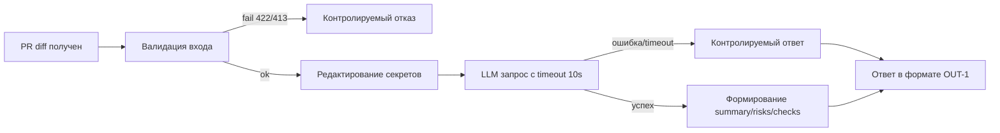

# Анализ процесса: AS IS и TO BE

## AS IS

Событие: разработчик или CI отправляет diff PR для автоматической проверки.

Процесс:
- Пользователь/CI делает POST на `/api/reviews` с JSON телом `{ "diff": "..." }`.
- Сервис без проверки размера и без редактирования секретов формирует prompt и отправляет весь diff во внешний LLM.
- Ответ LLM возвращается как произвольный текст в поле `comment` без структурированного формата.

Участники: разработчик/ревьюер, FastAPI сервис, внешний LLM провайдер.

Задержки и ручные операции:
- Нет таймаута/контролируемой деградации при сбое LLM (ожидание может быть долгим).
- Ревьюеру приходится вручную интерпретировать произвольный ответ.

Точки потери информации и риски:
- Возможная утечка секретов (diff отправляется как есть).
- Нет отказа по размеру diff > 20k, что ведет к ошибкам или деградации.
- Нет стабильного контракта ответа (нельзя надёжно автоматизировать). 

## TO BE

Небольшой процесс после изменений: ввод ограничений и контракта.

## Разница

| Что меняется | AS IS | TO BE | Как проверим изменение |
|---|---|---|---|
| Ограничение длины diff (API-1) | Нет | 413 при >20k | Интеграционный тест: diff >20k -> 413 |
| Редактирование секретов (SEC-1) | Нет | Секреты маскируются перед LLM | Интеграционный тест: подстановка фейкового секрета и проверка prompt |
| Формат ответа (OUT-1) | Произвольный `comment` | summary, risks(≤3), checks | Unit на формирование ответа; интеграционный контракт-тест |
| Таймаут и ошибки LLM (REL-1) | Нет | Timeout 10s и контролируемый ответ | Интеграционный тест с заглушкой LLM (timeout/исключение) |
| Валидация входа | Прямая индексация | Схема тела и типы, 422 при ошибке | Интеграционный тест: пустое/неверное тело |

## Как использовали AI

- Для чего: анализ процесса AS IS/TO BE и фиксация разницы.
- Тип промпта: master prompt (см. P1-02) и отдельная запись для подготовки (P1-03).
- Строка в [`prompts.md`](prompts.md): P1-03 — подготовка раздела Analysis (эта правка).
- Что проверили и исправили сами: проверки не выполнялись; evidence — планируется сохранять диаграммы и таблицу различий.
