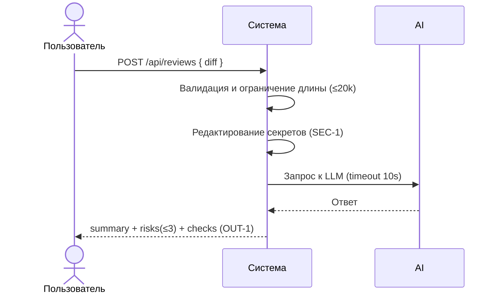

# Use cases и user stories

## Первый рабочий сценарий

**Когда** разработчик отправляет diff PR на анализ, **система** валидирует и ограничивает вход, редактирует секреты, делает контролируемый запрос к LLM и формирует структурированный ответ, **а пользователь получает** краткое summary, до трёх подтверждённых рисков с evidence и список проверок.

Не входит в этот сценарий:

- Автозапуск ревью из GitHub/merge-ботов.
- Авторизация/аутентификация и разграничение доступа.
- Длительное хранение содержимого diff и ответов LLM.

## Use case

| Поле | Значение |
|---|---|
| Актор | Разработчик/ревьюер или CI |
| Триггер | Появление diff PR и запрос на анализ |
| Предусловия | Доступность сервиса; корректный JSON с полем `diff`, длина ≤ 20,000 символов |
| Основной результат | Ответ в формате OUT-1: `summary`, `risks` (≤3: file, line, evidence, risk, rule), `checks` |
| Ошибка или отказ | 413 при слишком длинном diff (API-1); 422 при невалидном теле; контролируемый ответ при timeout/ошибке LLM (REL-1) |



## User stories и acceptance criteria

```gherkin
Feature: Автоматическое ревью diff PR

  Story: Как разработчик, я хочу получить краткое summary и до 3 рисков с evidence по моему PR, чтобы быстрее выявить проблемы

  Scenario: Позитивный — корректный diff
    Given сервис доступен
    And тело запроса содержит поле diff длиной ≤ 20000 символов
    When пользователь отправляет POST /api/reviews
    Then система возвращает 200 и JSON с полями summary, risks (≤3, с file,line,evidence,risk,rule) и checks

  Story: Как платформа CI, я хочу, чтобы сервис отклонял слишком большие diff, чтобы не тратить ресурсы впустую

  Scenario: Негативный — длинный diff
    Given сервис доступен
    And тело запроса содержит поле diff длиной > 20000 символов
    When пользователь отправляет POST /api/reviews
    Then система возвращает 413

  Story: Как разработчик, я хочу видеть валидационные ошибки до обращения к LLM

  Scenario: Негативный — отсутствует поле diff
    Given сервис доступен
    And тело запроса не содержит поля diff
    When пользователь отправляет POST /api/reviews
    Then система возвращает 422
```

## Как использовали AI

- Для чего: формулирование user stories и acceptance criteria.
- Тип промпта: master prompt (см. P1-02) и отдельная запись для подготовки (P1-03).
- Строка в [`prompts.md`](prompts.md): P1-03 — подготовка пользовательских сценариев (эта правка).
- Что проверили и исправили сами: без выполнения тестов; выравнивание story с CASE.md.
