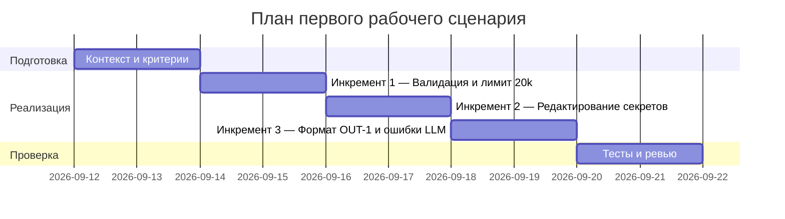

# План поставки

## Инкременты и ответственность

| Инкремент | Наблюдаемый результат | Что делает человек | Что делает AI или субагент | Проверка | Зависимости |
|---|---|---|---|---|---|
| 1 | Валидация входа и ограничение размера diff (413 >20k) | Описывает контракт входа, добавляет проверку длины | Подсказывает edge-cases, формирует список проверок | Интеграционный тест: >20k → 413; ≤20k → 200 | CASE.md правила (API-1) |
| 2 | Редактирование секретов перед LLM (SEC-1) | Добавляет редактирование и маски | Предлагает набор масок/паттернов | Интеграционный тест: фиктивный секрет → [REDACTED] в prompt | CASE.md правила (SEC-1) |
| 3 | Контролируемый ответ и формат OUT-1 | Реализует схему summary/risks/checks и обработку ошибок LLM | Генерирует шаблон ответа и тесты на схему | Unit и интеграционные контракт-тесты | CASE.md (OUT-1, REL-1) |

## Диаграмма Ганта

Замените даты и задачи на свой план.

## Как использовали AI

- Для чего: декомпозиция задач и планирование инкрементов.
- Тип промпта: master prompt (см. P1-02) и отдельная запись для подготовки (P1-03).
- Строка в [`prompts.md`](prompts.md): P1-03 — подготовка плана (эта правка).
- Что проверили и исправили сами: без выполнения тестов; синхронизация плана с правилами CASE.md.
